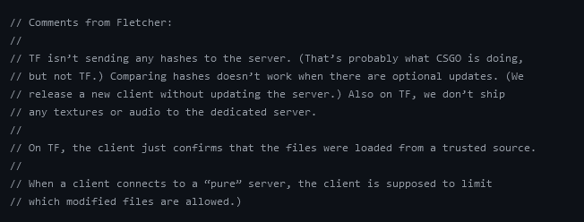
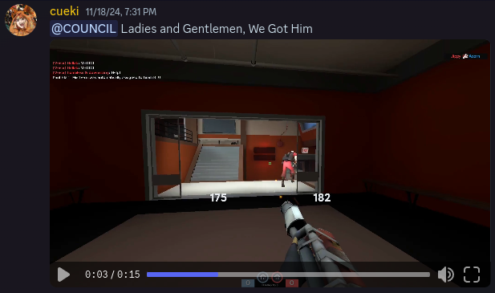
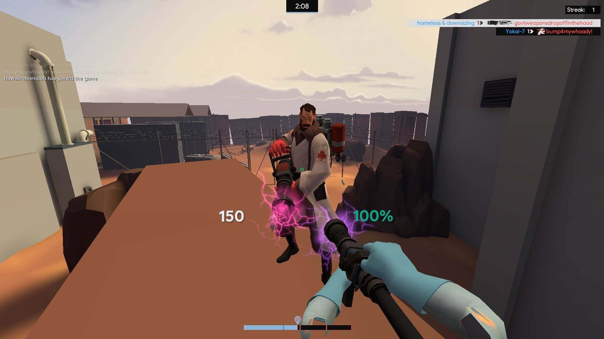
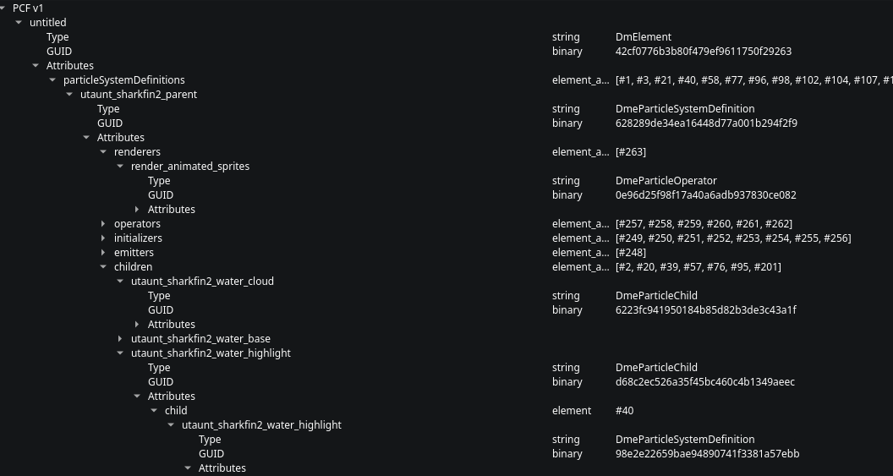
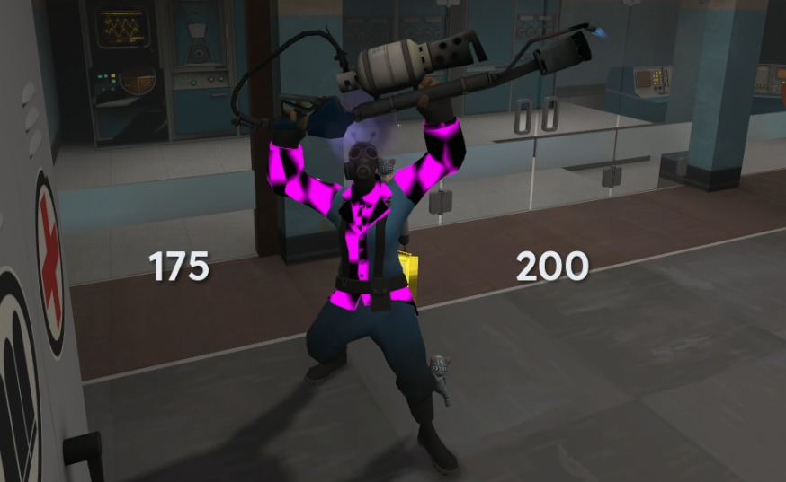

# How It Works
*What follows chronicles my perspective during the development of the preloader. If you wish to contact me, or anyone else who has worked on this, join the **[discord](https://discord.gg/64sNFhqUaB)**. — cueki*

## Mannifesto
### Context
In 2024, I was banned from RGL for abusing exploits I didn't fully understand. This document explains the technical details of what I built afterward, not as justification, but as documentation.

### Understanding the Foundation
I want this explanation to be approachable for a general audience, doing my best to keep technical terminology to a minimum. Some things, however, are unavoidably complicated. Thus, I will begin by explaining one fundamental concept.

When the Source engine was being developed, Valve's engineers had a performance problem to solve. Hard drives were slow - painfully slow compared to the SSDs of today. Reading data from disk every time you needed it would obliterate load times and kill performance. Their solution was to implement an aggressive caching system that 'holds on' to assets in memory that are likely to be used again soon.

As an example, TF2 has 9 classes that can exist on any map. Each class can shoot, move, reload, take damage, etc. Actions such as these are constantly called by the engine. It makes sense to load them once at game start and keep them in memory. This way, when you change maps, change classes, or switch weapons, the game doesn't have to wait for the hard drive to give it the same data repeatedly. The same logic applies to common map elements like health packs, control points, and frequently used textures; they often persist across several map changes to avoid redundant disk operations.

This caching system is the reason why we've always been able to 'preload' certain things. First-person animations are a primary example. They're called often and randomly by users, so all possible instances stay loaded in memory.

### sv_pure
To understand sv_pure, one must understand the origin of these games. Team Fortress, Counter-Strike, and Dota started as community mods - game rule modifications with custom assets slapped on top of existing engines. They relied entirely on engine extensibility to load custom content. The Source engine inherited this design, which means these games rely on engine code that's just fine with loading user-provided files.

This creates a problem: what if you want to limit what users can customize? One would need a system that can load their own content, but not the content of another,  while simultaneously allowing server operators to set rules as they see fit. Valve's solution was the sv_pure server whitelist. How it works is pretty simple: when a client connects to your server, it receives a list of ‘valid’ paths for customization that you have defined in a text file. The client then reads this list of valid paths and checks it against what it currently has loaded in memory. If it sees any invalid paths, it forces a reload on that file, reverting to what the game has set as its ‘default’.

```
whitelist
{
	// Allow custom player models.
	models\player\...           any
	materials\models\player\... any
	
	// Allow custom spray decals.
	materials\temp\...          any
	materials\vgui\logos\...    any
	materials\vgui\logos\ui\... any
	
	// Allow "mymod" resources to come from disk.
	materials\mymod\... any
	models\mymod\...    any
	sound\mymod\...     any
}
```

In theory, this system works pretty well. You have some code running on the client that should be unmodifiable (VAC protected - we’ll come back to that later), and as long as the default fallback files are protected by some sort of signature, which the client verifies (also VAC protected), then you should be good to go! Yet, here we are.

### The failure of sv_pure
By the very nature of the engine, this system is fragile. The game is hinging the entirety of asset loading on a single check. The game is also trusting the client to obediently unload its assets. The game is assuming you didn't have any oversights during implementation. The game is also assuming that the hash is properly checked during instantiation. This is a difficult problem with a band-aid fix. I don't fault a single developer at Valve for this. I couldn't have come up with a better solution myself (especially not in 2004). 

But don't take my word for it, here are some comments by Valve:





### Bypassing sv_pure, the easy way
The simplest method is to hook CPureServerWhitelist. This disables the whitelist check with minimal effort. When done at the driver level, it's essentially undetectable.

This is boring, and guaranteed to work with no discoveries left. It's also cheating, and feels icky.

### The hard way
As it stands, the preloader uses a combined total of **five** sv_pure bypasses to completely disable it. In order of importance: the gameinfo.txt exploit, the unchecked VPK md5 hash, VGUI material persistence, model dependency chaining, and nested directory exclusion. I will expand on each of these as we get to them. All of these exploits rely on each other in some form or fashion and require ‘preloading’ into an offline map prior to joining online matches. As such, there is no risk of a VAC ban, only a risk of Valve patching these exploits.

### Gameinfo.txt
Basically, changing one line in tf/gameinfo.txt disables large portions of the multiplayer sv_pure check, but not all. Off the top of my head, I believe it allows for custom materials, custom models (not map props), custom animations, as well as a few VGUI elements and lightwarps. This exploit has been around for some time. I remember reading a reddit thread back in ~2021 talking about its use in CS:GO, referencing the [CS:GO bugs repository](https://github.com/kkthxbye-code/csgo_bugs/tree/master). As I hadn't played tf2 in over a year at that point, I didn't think much about it, or even attempt to make a connection.

### MD5
The md5 hash being unchecked was something I mostly figured out on my own. [The knowledge was out there](https://github.com/ValveSoftware/Source-1-Games/issues/887), but my only clue was [this](https://www.youtube.com/watch?v=67LPSFtVlsk) shounic video, in which he deletes VPK files in tf/ to see if the game was still playable. This might seem innocuous, but from the perspective of a developer, this is a huge red flag; the game is not properly verifying files on launch. So, I started poking at it. I learned that when TF2 loads a VPK archive, it reads from a 'directory file'. This directory contains three pieces of information: the file's size, its MD5 hash (a cryptographic fingerprint used to verify the file hasn't been tampered with), and its location within the archive. See my [example](#vpk-structure) of a VPK for more info.

In 2023, I was blindly patching bytes within random files based on string lookups. My assumption was that this hash check was causing corruption. I didn't understand it at the time, but I was simply invalidating pointers in the directory header. When I reported myself in March of 2024, I forwarded the existence of these two exploits, aswell as the CS:GO bug repository to the RGL staff. 

And that was that, for a while.

### Baby Steps
In 2025, I decided to spend more time playing TF2 again. During this time, some friends inquired about decreasing the visual clutter of the pyro's flames. With my rough understanding of VPK editing and the untapped potential of the gameinfo.txt exploit, I got to work. With all that, the best I could get was:

```vmt
Spritecard
{
    "srgb?$overbrightfactor" "5"
    "$basetexture" "particle\flameThrowerFire\flamethrowerfire102"
    "$translucent" "1"
    "$addself" "0.5"
    "$DEPTHBLEND" "1"
    "$DEPTHBLENDSCALE" "100"
    "$startfadesize" ".3"
    "$endfadesize" ".5"
    "$maxsize" ".4" // change this to something like 0.05
    <dx90
    {
        "$maxsize" ".15" // this too
    }
}
```



Great! But underwhelming. They were happy with it. I wasn't. So, I did what anyone would do in my position. I sat down, and read documentation. There is not that much documentation on the particle system. The [wiki page](https://developer.valvesoftware.com/wiki/PCF) was complete enough for me to cobble together some basic understanding, and through this, some basic modifications. As I was now aware of the VPK header corruption, I knew that I couldn't modify the particle effects much. Thus, I started with some simple stuff, like colours. I even wrote some custom code to swap all the colours by a relative amount, essentially making a 'hue shifter' for particles.



Then I had an idea: what if I take a custom particle file, and patch over what it's meant to be replacing in game?

### Custom Particle Integration
This presents three obvious issues and one genuinely frustrating problem.

1. What if the file is smaller than what is in the game?
2. What if the file is missing something that is expected to be in the game?
3. What if the file is larger than what is expected in the game?
4. What if the particle system's load order behavior leads modders to organize files in a way that makes my life harder?

Since whatever loads last takes priority, modders naturally dump all their particles into single files instead of maintaining dozens of separate ones.  It's the easiest choice given how the system works.

Keep in mind, whenever you want to look at a particle file, your only real option is to load into some archaic particle editor that may or may not function after the 64bit update, or to look at it raw via an external tool, like VPKEdit:



!!! note "Side note"
    I want to give a massive shoutout to the [VPKEdit project](https://github.com/craftablescience/VPKEdit). Without this software, I would have never made it this far. The people behind it are really cool and really smart, you should definitely go and show some love, support their work, star their repositories, etc. They deserve it.

At the time, I knew I wouldn't make it very far if I didn't fully understand what I was working with. None of those problems would have realistic solutions if I couldn't precisely read and write this file type. So, the next step was to write a parser. What kind of parser? Two kinds: one for [PCF files](https://github.com/cueki/valve-parsers?tab=readme-ov-file#pcf-files), and one for [VPK files](https://github.com/cueki/valve-parsers?tab=readme-ov-file#quick-start-parsing--modification). This took quite some time, reading and writing binary data is not the easiest thing one can do. You can make subtle mistakes that don't reveal themselves for months. 

To give a brief overview on how particle files are structured, you have a file 'particle.pcf' which contains a header to tell the game what version it is, a string dictionary to map specific numbers to specific words, an element dictionary to map specific numbers to specific elements, and then the element data itself. 

So, a very tiny particle file might look like:
```
PCF File: tiny.pcf
Version: DMX_BINARY2_PCF1
Strings: 5 | Elements: 2

STRING DICTIONARY:

0. DmeElement
1. particleSystemDefinitions
2. DmeParticleSystemDefinition
3. radius
4. color

ELEMENTS:

[0] root
    Type: 0 [DmeElement]
    Name: "root"
    Attributes (1):
      - 1: [particleSystemDefinitions] → references element 1 [my_particle]

[1] my_particle
    Type: 2 (DmeParticleSystemDefinition)
    Name: "my_particle"
    Attributes (2):
      - 3: 5.0 [radius]
      - 4: RGBA(255, 255, 255, 255) [color]

And so on...
```

<a id="vpk-structure"></a>VPK files also use a tree structure, but for organizing file paths rather than element relationships. Here's an example using the mastercomfig flat-mouse addon:
```
VPK File: mastercomfig-flat-mouse-addon.vpk (224 bytes)

HEADER:

Signature:   0x55AA1234
Version:     2
Header Size: 28 bytes (always)
Tree Size:   47 bytes
Data Size:   149 bytes

DIRECTORY TREE:

Files organized as: extension -> path -> filename

Extension: "cfg"
    Path: "cfg/addons"
        Filename: "flat-mouse"
        CRC: 0xB497242C
        Archive Index: 0x7FFF (not a multi-part vpk)
        Offset: 0 (relative to tree)
        Length: 149 bytes (size)


EMBEDDED DATA (149 bytes at offset 75)

File: cfg/addons/flat-mouse.cfg
m_customaccel 0
m_filter 0
m_mousespeed 0
m_mouseaccel1 0
m_mouseaccel2 0
m_rawinput 1
zoom_sensitivity_ratio .793471
echo"Flat Mouse addon applied"
```

I don't know if it's worth concerning yourself with the intricacies of data structures, but these represent the boundaries I must exist within. The VPK must be valid and the PCF inside of the VPK must also be valid. 

So, let's start by tackling problem 1: what do we do if the files are smaller than what's in the VPK? Easy. As the VPK is reading in chunks based on the data size context, we can pad out remaining data with junk. All we need to do is find the difference in size between what's in the VPK and what we have as our file. We can then take that value and add `n*0x20` to guarantee the file size matches what is inside of the VPK.

On to problem 2. We know that the game loads particle files in a specific order. This order can be used to overwrite particles currently in the game. If we find an unused particle file that is loaded later, or a particle file that has some wasted space, we can use it to 'inject' elements that take priority. This is an interesting idea, but not super helpful unless we can figure out a way to deterministically find these instances of wasted space. It still doesn't help us, however, due to problem 3.

The 3rd problem is a pretty important one. We will always be restricted by size. This stumped me for about 2 months, but something in my gut told me to keep going. I know this game. I know how broken Source spaghetti can be. I knew there had to be something I was missing.

I was right.

### PCF Optimization
As it turns out, particle files are *extremely inefficient* in their design. Each particle file isn't actually a 'file'. The game flattens the whole particle directory as one big list of elements. It stores the references to the elements themselves, but not the particle files that contain them. This is why elements loaded later take priority. Each element is also designed to be readable completely on its own, if you were to rip out the explosion particle effect and put it into its own `custom_explosion.pcf`, it would have all the data required to render itself. This means that if `element1` and `element2` of `custom_explosion.pcf` only have a small change between them, there's a bunch of sub-referenced data that is duplicated and scattered across the file.

As shown in the example, everything is index referenced. So, if we [update the references](https://github.com/cueki/casual-pre-loader/blob/main/operations/pcf_compress.py#L38-L55) to use the same index for duplicated data, we can then discard all other instances of duplicate data. This solves problem 2. I can do better. Valve chose to keep a lot of default parameters set within the particle files, these [can be removed](https://github.com/cueki/casual-pre-loader/blob/main/operations/pcf_compress.py#L132-L150) with no issue for even more space. And if that's not enough, they also waste space with [unused strings](https://github.com/cueki/casual-pre-loader/blob/main/operations/pcf_compress.py#L108-L129) that can be blanked out with no downside. If you go through the effort to optimize the particle files in this way, you will see on average a 3-4x size improvement. This improvement is proportional to the file size, larger files with more elements will have more opportunities for deduplication.

Now that I've solved problem 3, what does this mean exactly? In the beginning, I used this extra space to squish every single particle element into a few large files, like `halloween.pcf` or `items_fx.pcf`. This is wildly inefficient but it worked well enough. One issue is that if effects are loaded later, they will be overwritten by the defaults. Also, if you wanted to mix and match certain particle effects, it just wasn't possible. An option was to update the `particle_manifest.txt` to circumvent some of these issues, but this lacked specific particle selection. I still felt I had something worth sharing. Welcome to v1.0.0 of the preloader. 

Problem 4, however, remained unsolved. Certain mod makers would package all of their particle effects into a singular file like `npc_fx.pcf`. Trying to put all of that into any one particle file while simultaneously fitting it into the game wasn't feasible. From here the solution seems obvious, right? All we have to do is create a [mapping](https://github.com/cueki/casual-pre-loader/blob/main/particle_system_map.json) that matches the entire particle system of the game, [walk the tree](https://github.com/cueki/casual-pre-loader/blob/main/operations/pcf_rebuild.py#L13-L32) of every element, find which elements are defined in what file, use that tree to then do a [reverse lookup](https://github.com/cueki/casual-pre-loader/blob/main/operations/pcf_rebuild.py#L53-L59) on each element in a mod, then [Frankenstein elements](https://github.com/cueki/casual-pre-loader/blob/main/operations/advanced_particle_merger.py) of the base game and the mod to reconstruct each particle file dynamically. Next, with each individual particle file now representing what the game would expect, we can compress and shove them into the game with padding. 

This took me another month or two to iron out. There are problems that require manual fixing. Some custom elements just never fit due to the nature of their base PCF files being so small. There are also [errors by Valve](https://steamcommunity.com/sharedfiles/filedetails/?id=3453232654), as well as some really strange behaviors from mod makers having dereferenced elements. On top of that, certain elements break the game's own rules and need to be statically defined in order to be properly linked.

Also, I had to get all of this in front of an end user and not have their head explode.

Let's recap. At this point we have the ability to load some custom materials via preloading with the gameinfo exploit, as well as animations, models, lightwarps, and now particles via direct VPK modification. What we couldn't load yet were skyboxes, props (which would start to throw caching errors), sounds, and decals. I also had no idea if anything further was realistic. I knew that directly modifying the VPKs would always be a solution, but there was no guarantee I would find a way to compress the data like I did with particle files.

### Model Dependency Chaining
The most impactful issue facing the app was model unloading. This was because the other two methods of preloading did not have this error. 



If my goal was to provide an 'all-in-one' solution, this had to be resolved. I was also unfamiliar with the way models worked, and did not feel like reverse engineering another data structure [*yet*](https://github.com/craftablescience/sourcepp/pull/85). I knew that my method worked *sometimes* for *some reason*, so I got to work narrowing down the issue. A quick bandaid fix I discovered shortly thereafter was to use the ['quickprecache'](https://github.com/Lucifixion/QuickPrecache) method developed by goopswagger. Since there was an open invitation to port the code from java to anything else, I took it upon myself to do so in python and then expose the library to the preloader. Get ready for more examples.

Let's say you have these mods installed:
```
/tf/custom/
├── cool_maps_mod/
│   └── models/
│       ├── props/model1.mdl
│       └── props/model2.mdl
└── extra_gameplay_items/
    └── materials/
        └── items/material.vmt
```
QuickPrecache scans and finds:
```
props/model1.mdl
props/model2.mdl
```
It creates a file called precache_0.qc and compiles it with studiomdl:
```
// precache_0.qc
    $modelname "precache_0.mdl"
    $includemodel "props/model1.mdl"
    $includemodel "props/model2.mdl"
```
Then it creates precache.qc and also compiles it with studiomdl:
```
// precache.qc
    $modelname "precache.mdl"
    $includemodel "precache_0.mdl"
```
Contained within the _QuickPreCache.vpk is an already compiled competitive_badge.mdl that contains:
```
// competitive_badge.mdl
    $includemodel "precache.mdl"
```
Which creates a dependency chain:
```
competitive_badge.mdl (in _QuickPrecache.vpk)
    - $includemodel precache.mdl (in /tf/models/)
        - $includemodel precache_0.mdl (in /tf/models/)
            - $includemodel
            ├── props/model1.mdl (in /tf/custom/cool_maps_mod/)
            └── props/model2.mdl (in /tf/custom/cool_maps_mod/)
```

The competitive badge never gets unloaded because it exists on the scoreboard. Therefore, the models that become linked in this manner also never unload. This has some strange effects on the game. For reasons I do not fully understand, if custom playermodels are linked in this manner, the lighting sometimes breaks, resulting in completely black cosmetics. However, with further investigation, I deduced that quickprecache was not necessary for most models, and only useful for map props. With a bit of help from community testing, we narrowed it down to a [filter](https://github.com/cueki/casual-pre-loader/blob/main/core/constants.py#L159-L167) that will activate quickprecache when necessary if certain types of models exist.

### Decals
The next thing I thought to tackle was decals. I underestimated just how annoying their implementation was in the engine. Decals use a material shader called a [‘subrect’](https://developer.valvesoftware.com/wiki/Subrect) so that they can be rendered both on the world and on models. There are some weird rules about this, in order to modulate the decal to feign depth, they use the difference between the texture the decal is being applied to and the grey scale (RGB 127, 127, 127). The [wiki](https://developer.valvesoftware.com/wiki/Decals#DecalModulate) explains this better than I can. Decals also use a sprite sheet, mod2x, which allocates small squares (think 128x128) for each texture. This means that if the mod maker created their own textures, and kept them as individual files at a higher resolution, I would need to simultaneously convert them to this awkward grey scale alpha channel, as well as compress them into lower-quality versions. The reason this remains unfinished to this day is because doing it all automatically looks terrible. 

### VGUI Caching
Decals were not all in vain, as when attempting different methods of getting the game to accept larger textures, I started tinkering with another method that opened the door for further caching. Thankfully this ‘VGUI preloading’ is not nearly as complicated. Similar to how quickprecache creates a dependency chain for models, by loading textures in the HUD (offscreen), they will persist between map changes. I wrote a standalone script to generate the .res file structure given a set of input files. First thing I got working was [skyboxes](https://github.com/cueki/casual-pre-loader/blob/main/core/handlers/skybox_handler.py) (which still required me directly patching the VPK with skybox VMTs) but once I had that figured out, akuji came up with the idea of loading warpaints in the same way. This involved locating every single warpaint path in the game, and the result was a 50,000 line long [vguipreload.res](https://github.com/cueki/casual-pre-loader/blob/main/backup/resource/ui/vguipreload.res) file. These textures are not actively rendered, but their reference stays in memory, and that's what matters.

### Soundscripts
This leaves sounds as the last thing to be modifiable, but at this point, the burnout was starting to get to me. I first heard of the soundscripts method via the [tf.tv](https://www.teamfortress.tv/51593/cheating-to-hear-spies-is-painfully-easy) post by pete, but the idea of adding it to the preloader felt demotivating because all the discovery had already been done. Alas, akuji came to me after some testing to verify that the bypass was as simple as putting the sound files in `misc/`, and then [updating the sound scripts](https://github.com/cueki/casual-pre-loader/blob/main/core/handlers/sound_handler.py#L119-L175) to reflect the new location. 

### Thank You!
I would like to thank some notable individuals in this process.

[pliso](https://gamebanana.com/members/1664112) and [goopswagger](https://gamebanana.com/members/1672887), for starting the TF2 modding renaissance in 2023 via their preload methods.

The various mod makers whose passion breathes new life into this 18 year old game.

My discord community for helping me test and debug each iteration of this process.

djsigmann, feathers, akuji, and astrid for helping me write and edit this document.

And finally,

[yttrium](https://github.com/Yttrium-tYcLief/). I don't know if you will ever read this, but you laid the groundwork that made everything else possible. I know you may have some reservations about what this enables, but I encourage you to look a little closer at my code. I did the best I could given my limitations.

### Closing Remarks
Seven years ago, I asked a question about how to do what this application does. I didn't know the answer then. I barely understood the question. But I stayed curious, and curiosity turned into understanding. Whatever you're working on, whatever seems impossible, keep going, I believe in you.


